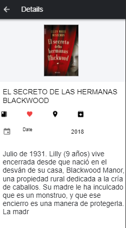
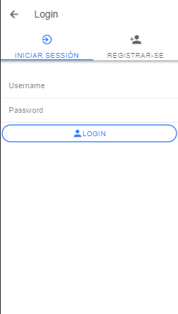
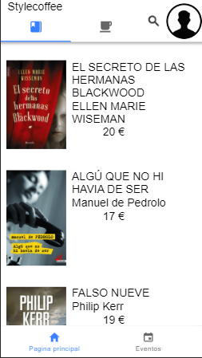
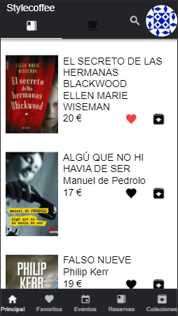
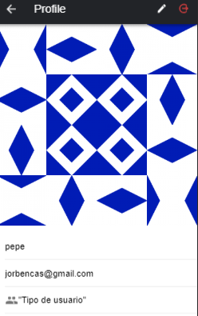
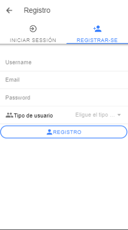
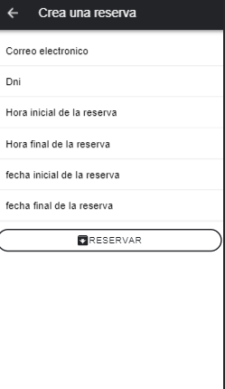

## StyleCoffee_App

> ### Oficial app of StyleCoffee 

The main purpose of this project is build a MNobil Aplication using Ionic and Angular 6, from anyone that love readedind and drinck some coffee taza in beatifull, wonderfull place, Stylecoffee is ypour perfect app to informe of all own events, books and coffees.

## Functionalities
+ ** List/Details
+ ** Filter books and coffes by generes and kind
+ ** Add/Remove Favorites books
+ ** CRUD collections
+ ** Manage your profile, upload local images
+ ** Subscribe Events
+ ** Filter events by authors
+ ** See StyleCoffe location of some google Maps
+ ** Reserve any book and follow his progres
+ ** User reserve Notifications

## Screens of my App

# 
### Details Screen

# 
### Login Screen

# 
### List Books without login 

# 
### List Books with login 

# 
### Profile Screen 

# 
### Register Login 

# 
### Reserve Screen 

 # This project is a mobile version of StyleCoffe app, You can see -> https://github.com/jorbencas/StyleCoffee.git